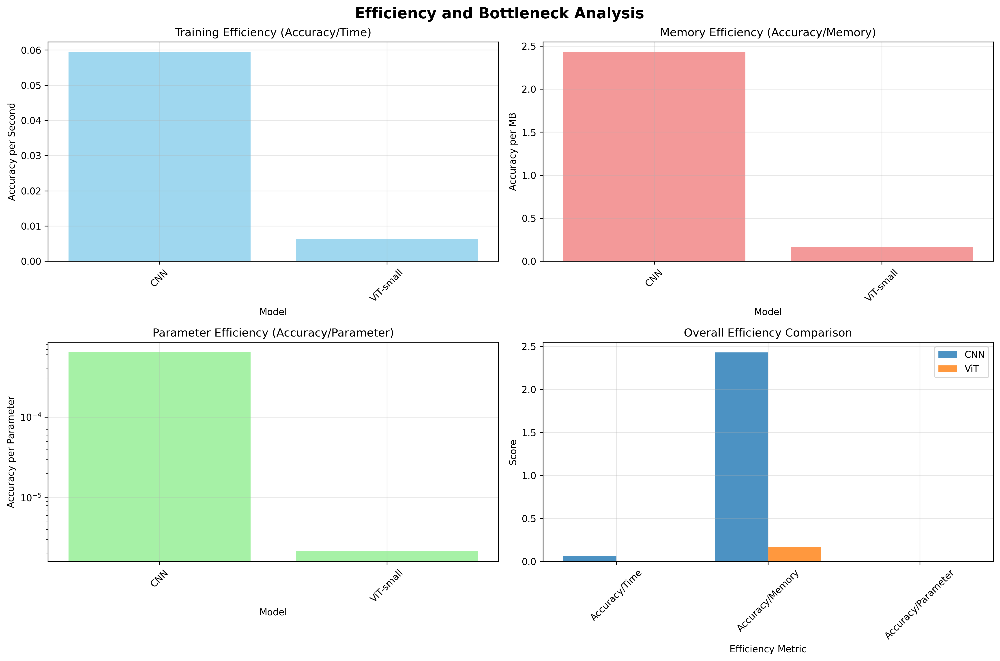
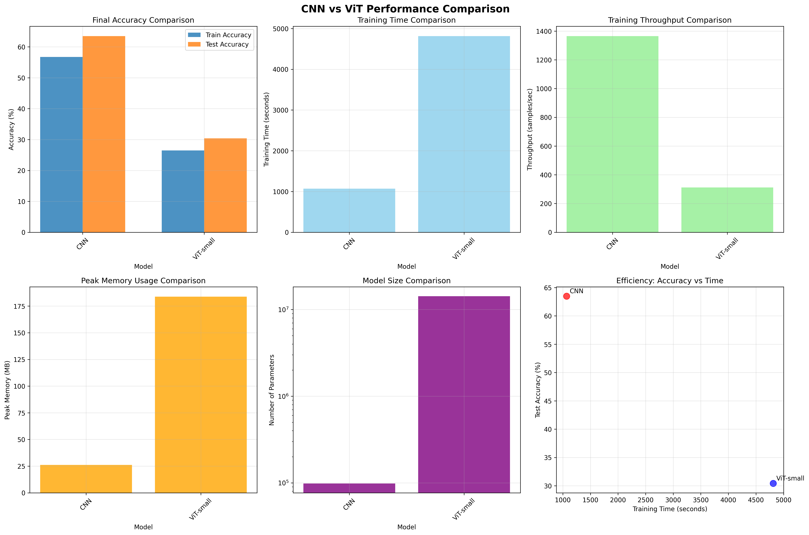
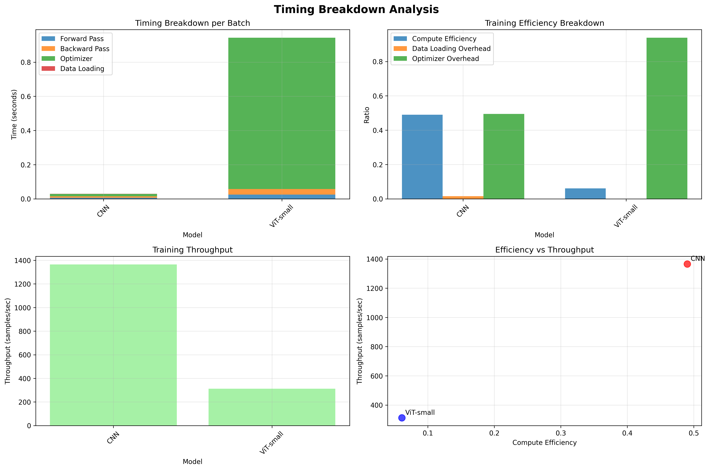

# CNN vs Vision Transformer Benchmark

A performance comparison of CNN and Vision Transformer architectures on CIFAR-10 image classification.

## 🎯 Project Overview

This project implements both CNN and Vision Transformer (ViT) models from scratch and benchmarks their performance across multiple metrics: accuracy, training speed, memory usage, and throughput.

## 📊 Key Results






| Model | Accuracy | Training Time | Memory | Parameters |
|-------|----------|---------------|---------|------------|
| **CNN** | 63.47% | 1069s | 26 MB | 98K |
| **ViT-small** | 30.41% | 4813s | 184 MB | 14.2M |

**Key Findings:**
- CNN trains **4.7× faster** and uses **7× less memory**
- CNN achieves **2× higher accuracy** on CIFAR-10
- ViT underperforms due to small dataset size (50K images) - needs 1M+ images to excel

## 🛠️ Technologies Used

- **PyTorch** - Deep learning framework
- **CUDA** - GPU acceleration
- **Mixed Precision Training** - Memory optimization
- **NumPy, Matplotlib, Seaborn** - Data analysis and visualization

## 🚀 Quick Start

```bash
# Install dependencies
pip install torch torchvision numpy matplotlib seaborn einops psutil

# Run benchmark
python benchmark_runner.py
```

## 📁 Project Structure

```
├── cnn_model.py           # CNN implementation
├── vit_model.py           # Vision Transformer implementation
├── benchmark_runner.py    # Benchmarking framework
├── model_profiler.py      # Performance profiling
└── data_utils.py          # CIFAR-10 data loading
```

## 🔬 Model Architectures

### CNN
- 3 convolutional blocks with max pooling
- Fully connected layers with dropout
- 98K parameters

### Vision Transformer
- Patch embedding (4×4 patches)
- Multi-head self-attention (8 heads)
- 6-12 transformer blocks
- 14M+ parameters

## 💡 Key Insights

**Why CNN outperformed ViT:**
1. **Dataset size** - CIFAR-10 (50K images) is too small for ViT (needs 1M+)
2. **Image resolution** - 32×32 pixels provides only 64 patches for attention
3. **Inductive bias** - CNN's built-in translation equivariance helps with limited data
4. **Model size** - ViT is undertrained (14M params on 50K samples)

**When to use each:**
- **CNN**: Small datasets, limited compute, faster inference needed
- **ViT**: Large datasets (1M+ images), sufficient compute, transfer learning

## 📈 Generated Outputs

The benchmark generates:
- Accuracy comparison plots
- Memory usage analysis
- Training time breakdown
- Efficiency metrics (accuracy/time/memory)
- JSON report with detailed metrics

## 🎓 Learning Outcomes

- Implemented Vision Transformer with self-attention from scratch
- Built automated performance profiling framework
- Analyzed model-dataset fit and computational trade-offs
- Optimized training with mixed precision and GPU acceleration
